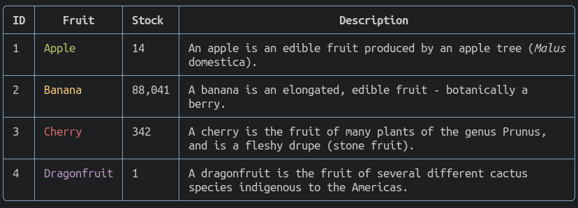
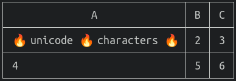

# table: Tables for terminals

This is a Go module for rendering tables in the terminal.



## Features

- :arrow_up_down: Headers/footers
- :leftwards_arrow_with_hook: Text wrapping
- :twisted_rightwards_arrows: Auto-merging of cells
- :interrobang: Customisable line/border characters
- :rainbow: Customisable line/border colours
- :play_or_pause_button: Individually enable/disable borders, row lines
- :left_right_arrow: Set alignments on a per-column basis, with separate settings for headers/footers
- :triangular_ruler: Intelligently wrap/pad/measure ANSI coloured input
- :fire: Support for double-width unicode characters

## Examples

<!--eg-->
### Example: Basic
```go
package main

import (
	"os"

	"github.com/aquasecurity/table"
)

func main() {

	t := table.New(os.Stdout)

	t.SetHeaders("ID", "Fruit", "Stock")

	t.AddRow("1", "Apple", "14")
	t.AddRow("2", "Banana", "88,041")
	t.AddRow("3", "Cherry", "342")
	t.AddRow("4", "Dragonfruit", "1")

	t.Render()
}

```

#### Output
```
┌────┬─────────────┬────────┐
│ ID │    Fruit    │ Stock  │
├────┼─────────────┼────────┤
│ 1  │ Apple       │ 14     │
├────┼─────────────┼────────┤
│ 2  │ Banana      │ 88,041 │
├────┼─────────────┼────────┤
│ 3  │ Cherry      │ 342    │
├────┼─────────────┼────────┤
│ 4  │ Dragonfruit │ 1      │
└────┴─────────────┴────────┘

```

### Example: No Row Lines
```go
package main

import (
	"os"

	"github.com/aquasecurity/table"
)

func main() {

	t := table.New(os.Stdout)
	t.SetRowLines(false)

	t.SetHeaders("ID", "Fruit", "Stock")

	t.AddRow("1", "Apple", "14")
	t.AddRow("2", "Banana", "88,041")
	t.AddRow("3", "Cherry", "342")
	t.AddRow("4", "Dragonfruit", "1")

	t.Render()
}

```

#### Output
```
┌────┬─────────────┬────────┐
│ ID │    Fruit    │ Stock  │
├────┼─────────────┼────────┤
│ 1  │ Apple       │ 14     │
│ 2  │ Banana      │ 88,041 │
│ 3  │ Cherry      │ 342    │
│ 4  │ Dragonfruit │ 1      │
└────┴─────────────┴────────┘

```

### Example: No Borders
```go
package main

import (
	"os"

	"github.com/aquasecurity/table"
)

func main() {

	t := table.New(os.Stdout)
	t.SetBorders(false)

	t.SetHeaders("ID", "Fruit", "Stock")

	t.AddRow("1", "Apple", "14")
	t.AddRow("2", "Banana", "88,041")
	t.AddRow("3", "Cherry", "342")
	t.AddRow("4", "Dragonfruit", "1")

	t.Render()
}

```

#### Output
```
 ID │    Fruit    │ Stock  
────┼─────────────┼────────
 1  │ Apple       │ 14     
────┼─────────────┼────────
 2  │ Banana      │ 88,041 
────┼─────────────┼────────
 3  │ Cherry      │ 342    
────┼─────────────┼────────
 4  │ Dragonfruit │ 1      

```

### Example: No Borders Or Row Lines
```go
package main

import (
	"os"

	"github.com/aquasecurity/table"
)

func main() {

	t := table.New(os.Stdout)
	t.SetRowLines(false)
	t.SetBorders(false)

	t.SetHeaders("ID", "Fruit", "Stock")

	t.AddRow("1", "Apple", "14")
	t.AddRow("2", "Banana", "88,041")
	t.AddRow("3", "Cherry", "342")
	t.AddRow("4", "Dragonfruit", "1")

	t.Render()
}

```

#### Output
```
 ID │    Fruit    │ Stock  
────┼─────────────┼────────
 1  │ Apple       │ 14     
 2  │ Banana      │ 88,041 
 3  │ Cherry      │ 342    
 4  │ Dragonfruit │ 1      

```

### Example: Specific Borders
```go
package main

import (
	"os"

	"github.com/aquasecurity/table"
)

func main() {

	t := table.New(os.Stdout)
	t.SetRowLines(false)
	t.SetBorderLeft(true)
	t.SetBorderRight(false)
	t.SetBorderTop(true)
	t.SetBorderBottom(false)

	t.SetHeaders("ID", "Fruit", "Stock")

	t.AddRow("1", "Apple", "14")
	t.AddRow("2", "Banana", "88,041")
	t.AddRow("3", "Cherry", "342")
	t.AddRow("4", "Dragonfruit", "1")

	t.Render()
}

```

#### Output
```
┌────┬─────────────┬────────
│ ID │    Fruit    │ Stock  
├────┼─────────────┼────────
│ 1  │ Apple       │ 14     
│ 2  │ Banana      │ 88,041 
│ 3  │ Cherry      │ 342    
│ 4  │ Dragonfruit │ 1      

```

### Example: Footers
```go
package main

import (
	"os"

	"github.com/aquasecurity/table"
)

func main() {

	t := table.New(os.Stdout)

	t.SetHeaders("ID", "Fruit", "Stock")
	t.SetFooters("ID", "Fruit", "Stock")

	t.AddRow("1", "Apple", "14")
	t.AddRow("2", "Banana", "88,041")
	t.AddRow("3", "Cherry", "342")
	t.AddRow("4", "Dragonfruit", "1")

	t.Render()
}

```

#### Output
```
┌────┬─────────────┬────────┐
│ ID │    Fruit    │ Stock  │
├────┼─────────────┼────────┤
│ 1  │ Apple       │ 14     │
├────┼─────────────┼────────┤
│ 2  │ Banana      │ 88,041 │
├────┼─────────────┼────────┤
│ 3  │ Cherry      │ 342    │
├────┼─────────────┼────────┤
│ 4  │ Dragonfruit │ 1      │
├────┼─────────────┼────────┤
│ ID │    Fruit    │ Stock  │
└────┴─────────────┴────────┘

```

### Example: Padding
```go
package main

import (
	"os"

	"github.com/aquasecurity/table"
)

func main() {

	t := table.New(os.Stdout)
	t.SetPadding(5)

	t.SetHeaders("ID", "Fruit", "Stock")

	t.AddRow("1", "Apple", "14")
	t.AddRow("2", "Banana", "88,041")
	t.AddRow("3", "Cherry", "342")
	t.AddRow("4", "Dragonfruit", "1")

	t.Render()
}

```

#### Output
```
┌────────────┬─────────────────────┬────────────────┐
│     ID     │        Fruit        │     Stock      │
├────────────┼─────────────────────┼────────────────┤
│     1      │     Apple           │     14         │
├────────────┼─────────────────────┼────────────────┤
│     2      │     Banana          │     88,041     │
├────────────┼─────────────────────┼────────────────┤
│     3      │     Cherry          │     342        │
├────────────┼─────────────────────┼────────────────┤
│     4      │     Dragonfruit     │     1          │
└────────────┴─────────────────────┴────────────────┘

```

### Example: Alignment
```go
package main

import (
	"os"

	"github.com/aquasecurity/table"
)

func main() {

	t := table.New(os.Stdout)
	t.SetAlignment(table.AlignLeft, table.AlignCenter, table.AlignRight)

	t.SetHeaders("ID", "Fruit", "Stock")

	t.AddRow("1", "Apple", "14")
	t.AddRow("2", "Banana", "88,041")
	t.AddRow("3", "Cherry", "342")
	t.AddRow("4", "Dragonfruit", "1")

	t.Render()
}

```

#### Output
```
┌────┬─────────────┬────────┐
│ ID │    Fruit    │ Stock  │
├────┼─────────────┼────────┤
│ 1  │    Apple    │     14 │
├────┼─────────────┼────────┤
│ 2  │   Banana    │ 88,041 │
├────┼─────────────┼────────┤
│ 3  │   Cherry    │    342 │
├────┼─────────────┼────────┤
│ 4  │ Dragonfruit │      1 │
└────┴─────────────┴────────┘

```

### Example: Rounded Corners
```go
package main

import (
	"os"

	"github.com/aquasecurity/table"
)

func main() {

	t := table.New(os.Stdout)
	t.SetDividers(table.UnicodeRoundedDividers)

	t.SetHeaders("ID", "Fruit", "Stock")

	t.AddRow("1", "Apple", "14")
	t.AddRow("2", "Banana", "88,041")
	t.AddRow("3", "Cherry", "342")
	t.AddRow("4", "Dragonfruit", "1")

	t.Render()
}

```

#### Output
```
╭────┬─────────────┬────────╮
│ ID │    Fruit    │ Stock  │
├────┼─────────────┼────────┤
│ 1  │ Apple       │ 14     │
├────┼─────────────┼────────┤
│ 2  │ Banana      │ 88,041 │
├────┼─────────────┼────────┤
│ 3  │ Cherry      │ 342    │
├────┼─────────────┼────────┤
│ 4  │ Dragonfruit │ 1      │
╰────┴─────────────┴────────╯

```

### Example: Custom Dividers
```go
package main

import (
	"os"

	"github.com/aquasecurity/table"
)

func main() {

	t := table.New(os.Stdout)
	t.SetDividers(table.Dividers{
		ALL: "@",
		NES: "@",
		NSW: "@",
		NEW: "@",
		ESW: "@",
		NE:  "@",
		NW:  "@",
		SW:  "@",
		ES:  "@",
		EW:  "~",
		NS:  "!",
	})

	t.SetHeaders("ID", "Fruit", "Stock")

	t.AddRow("1", "Apple", "14")
	t.AddRow("2", "Banana", "88,041")
	t.AddRow("3", "Cherry", "342")
	t.AddRow("4", "Dragonfruit", "1")

	t.Render()
}

```

#### Output
```
@~~~~@~~~~~~~~~~~~~@~~~~~~~~@
! ID !    Fruit    ! Stock  !
@~~~~@~~~~~~~~~~~~~@~~~~~~~~@
! 1  ! Apple       ! 14     !
@~~~~@~~~~~~~~~~~~~@~~~~~~~~@
! 2  ! Banana      ! 88,041 !
@~~~~@~~~~~~~~~~~~~@~~~~~~~~@
! 3  ! Cherry      ! 342    !
@~~~~@~~~~~~~~~~~~~@~~~~~~~~@
! 4  ! Dragonfruit ! 1      !
@~~~~@~~~~~~~~~~~~~@~~~~~~~~@

```

### Example: Auto Merge Cells
```go
package main

import (
	"os"
	"time"

	"github.com/aquasecurity/table"
)

func main() {

	t := table.New(os.Stdout)

	t.SetAutoMerge(true)

	t.SetHeaders("System", "Status", "Last Check")

	t.AddRow("Life Support", "OK", time.Now().Format(time.Stamp))
	t.AddRow("Nuclear Generator", "OK", time.Now().Add(-time.Minute).Format(time.Stamp))
	t.AddRow("Weapons Systems", "FAIL", time.Now().Format(time.Stamp))
	t.AddRow("Shields", "OK", time.Now().Format(time.Stamp))

	t.Render()
}

```

#### Output
```
┌───────────────────┬────────┬─────────────────┐
│      System       │ Status │   Last Check    │
├───────────────────┼────────┼─────────────────┤
│ Life Support      │ OK     │ May 13 08:54:29 │
├───────────────────┤        ├─────────────────┤
│ Nuclear Generator │        │ May 13 08:53:29 │
├───────────────────┼────────┼─────────────────┤
│ Weapons Systems   │ FAIL   │ May 13 08:54:29 │
├───────────────────┼────────┤                 │
│ Shields           │ OK     │                 │
└───────────────────┴────────┴─────────────────┘

```
<!--/eg-->

## Example: Double-width Unicode
```go
package main

import (
	"os"

	"github.com/aquasecurity/table"
)

func main() {
	t := table.New(os.Stdout)
	t.SetHeaders("A", "B", "C")
	t.AddRow("🔥 unicode 🔥 characters 🔥", "2", "3")
	t.AddRow("4", "5", "6")
	t.Render()
}

```

#### Output


## Example: ANSI Colours
```go
package main

import (
	"os"

	"github.com/aquasecurity/table"
	"github.com/liamg/tml"
)

func main() {

	t := table.New(os.Stdout)

	t.SetHeaders("ID", "Fruit", "Stock", "Description")
	t.SetHeaderStyle(table.StyleBold)
	t.SetLineStyle(table.StyleBlue)
	t.SetDividers(table.UnicodeRoundedDividers)

	t.AddRow("1", tml.Sprintf("<green>Apple</green>"), "14", tml.Sprintf("An apple is an edible fruit produced by an apple tree (<italic>Malus domestica</italic>). "))
	t.AddRow("2", tml.Sprintf("<yellow>Banana</yellow>"), "88,041", "A banana is an elongated, edible fruit - botanically a berry.")
	t.AddRow("3", tml.Sprintf("<red>Cherry</red>"), "342", "A cherry is the fruit of many plants of the genus Prunus, and is a fleshy drupe (stone fruit). ")
	t.AddRow("4", tml.Sprintf("<magenta>Dragonfruit</magenta>"), "1", "A dragonfruit is the fruit of several different cactus species indigenous to the Americas.")

	t.Render()
}
```

#### Output


